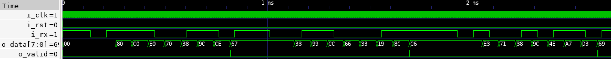
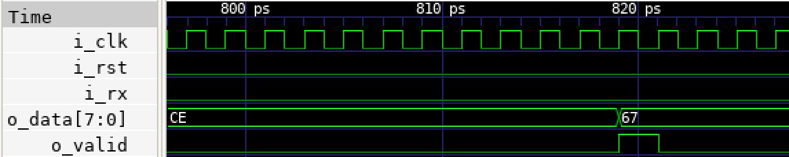
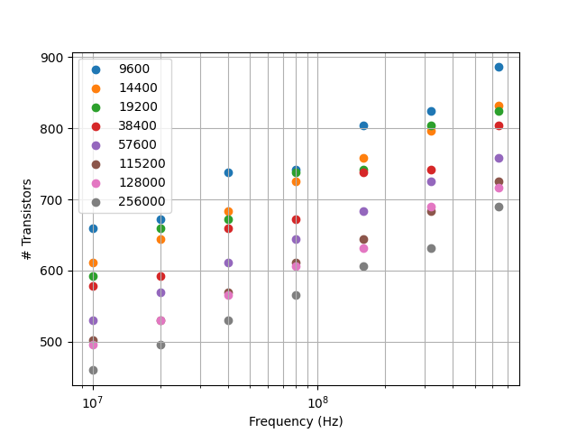
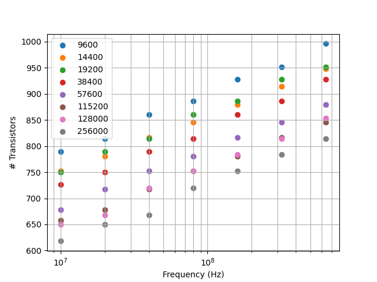

# rtl-uart

 - Very simple UART modules written in SystemVerilog
   - 1 Rx module
   - 1 Tx module
   - Operation
      - Least significant bit first
      - 1 Start bit
      - 8 Data bits
      - No parity bit
      - 1 Stop bit
 - Verified with Verilator
   - 9600 to 256000 baud
   - 10MHz to 640MH (``i_clk``)
   - Transactors included
   - Waveform examples included
 - Synthesised with Yosys
   - Parameter sweep with cmos tech transistor count
- Proven on FPGA
   - Lattice ...
   - FTDI ...

## rtl/x_uart_rx

### Parameters
 
 - ``p_clk_hz``: ``i_clk`` frequency in Hz
 - ``p_baud``: Baud rate

### Signals

- ``i_clk``: Clock
- ``i_rst``: Reset active high
- ``i_rx``: Input, 1-bit wide UART receive wire
- ``o_valid``: Output, 1-bit wide control asserted high when transmission received present on ``o_data``   
- ``o_data``: Output, 8-bit wide data received

### Waves

### Synthesised Size

## rtl/x_uart_tx

### Parameters
 
 - ``p_clk_hz``: ``i_clk`` frequency in Hz
 - ``p_baud``: Baud rate

### Signals

 - ``i_clk``: Clock
 - ``i_rst``: Reset active high
 - ``i_data``: Input, 8-bit wide data to be transmitted
 - ``o_tx``: Output, 1-bit wide UART transmit wire
 - ``i_valid``: Input, 1-bit wide control signal to be asserted high when ``i_data`` is ready
 - ``o_accept``: Output, 1-bit wide control signal asserted once ``i_data`` captured 

### Synthesised Size

## Verification

